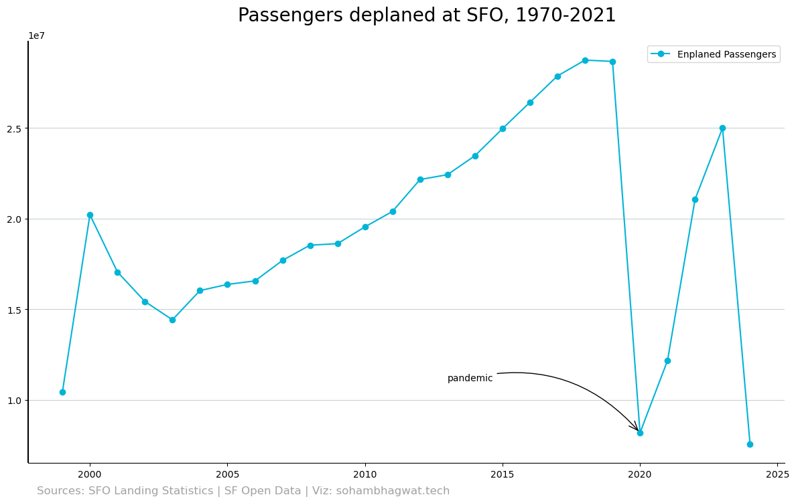
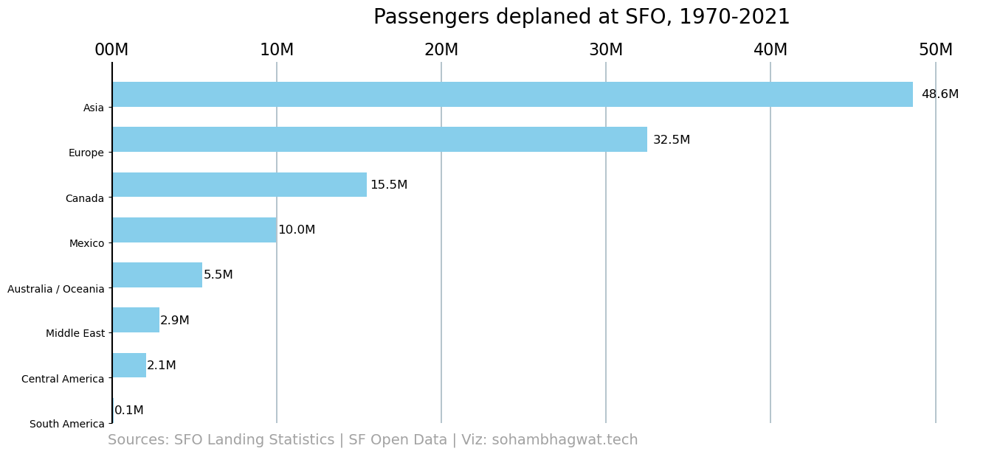
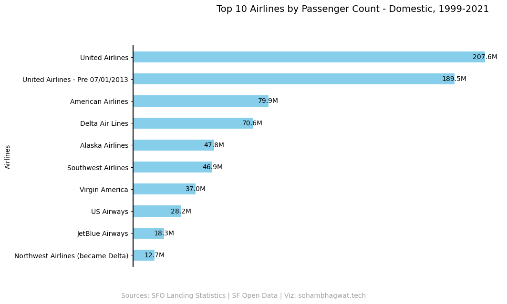
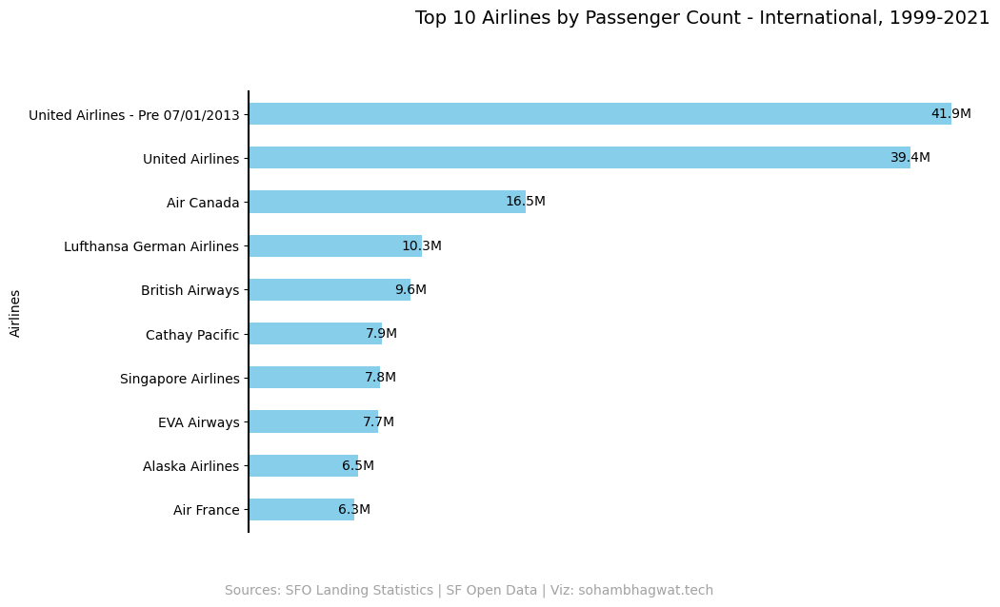
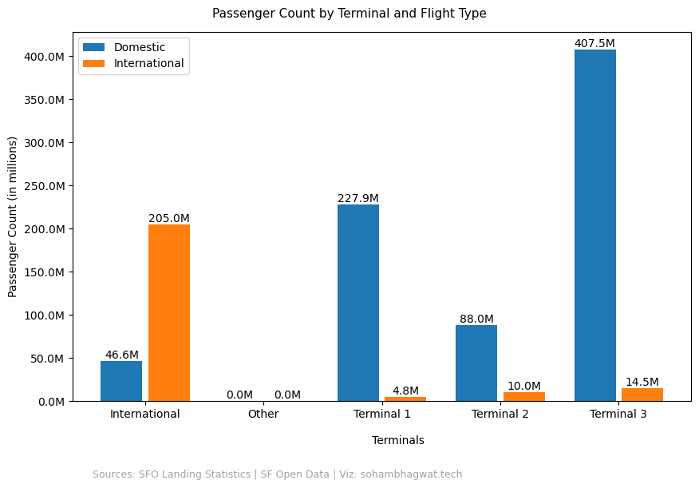

### Welcome to a basic data analysismini-project. We will be primarily using Pandas and Matplotlib for this mini-project. You'll get to learn some basic analysis as well as data visualization through this walk thorugh.

#### Dataset used: https://data.sfgov.org/Transportation/Air-Traffic-Landings-Statistics/fpux-q53t/about_data

#
#


Let's start with importing the required libraries


```python
import pandas as pd
import matplotlib.pyplot as plt
from highlight_text import ax_text, fig_text
# custom fonts
from matplotlib import font_manager
from matplotlib.font_manager import FontProperties

# arrows
from matplotlib.patches import FancyArrowPatch

#dates
import matplotlib.dates as mdates

#ticker
import matplotlib.ticker as ticker
```


```python
df = pd.read_csv('Air_Traffic_Passenger_Statistics_20240629.csv')
df.head(5)
```


<div>
<style scoped>
    .dataframe tbody tr th:only-of-type {
        vertical-align: middle;
    }

    .dataframe tbody tr th {
        vertical-align: top;
    }

    .dataframe thead th {
        text-align: right;
    }
</style>
<table border="1" class="dataframe">
  <thead>
    <tr style="text-align: right;">
      <th></th>
      <th>Activity Period</th>
      <th>Activity Period Start Date</th>
      <th>Operating Airline</th>
      <th>Operating Airline IATA Code</th>
      <th>Published Airline</th>
      <th>Published Airline IATA Code</th>
      <th>GEO Summary</th>
      <th>GEO Region</th>
      <th>Activity Type Code</th>
      <th>Price Category Code</th>
      <th>Terminal</th>
      <th>Boarding Area</th>
      <th>Passenger Count</th>
      <th>data_as_of</th>
      <th>data_loaded_at</th>
    </tr>
  </thead>
  <tbody>
    <tr>
      <th>0</th>
      <td>199907</td>
      <td>1999/07/01</td>
      <td>ATA Airlines</td>
      <td>TZ</td>
      <td>ATA Airlines</td>
      <td>TZ</td>
      <td>Domestic</td>
      <td>US</td>
      <td>Deplaned</td>
      <td>Low Fare</td>
      <td>Terminal 1</td>
      <td>B</td>
      <td>31432</td>
      <td>2024/06/20 01:00:26 PM</td>
      <td>2024/06/22 03:01:45 PM</td>
    </tr>
    <tr>
      <th>1</th>
      <td>199907</td>
      <td>1999/07/01</td>
      <td>ATA Airlines</td>
      <td>TZ</td>
      <td>ATA Airlines</td>
      <td>TZ</td>
      <td>Domestic</td>
      <td>US</td>
      <td>Enplaned</td>
      <td>Low Fare</td>
      <td>Terminal 1</td>
      <td>B</td>
      <td>31353</td>
      <td>2024/06/20 01:00:26 PM</td>
      <td>2024/06/22 03:01:45 PM</td>
    </tr>
    <tr>
      <th>2</th>
      <td>199907</td>
      <td>1999/07/01</td>
      <td>ATA Airlines</td>
      <td>TZ</td>
      <td>ATA Airlines</td>
      <td>TZ</td>
      <td>Domestic</td>
      <td>US</td>
      <td>Thru / Transit</td>
      <td>Low Fare</td>
      <td>Terminal 1</td>
      <td>B</td>
      <td>2518</td>
      <td>2024/06/20 01:00:26 PM</td>
      <td>2024/06/22 03:01:45 PM</td>
    </tr>
    <tr>
      <th>3</th>
      <td>199907</td>
      <td>1999/07/01</td>
      <td>Aeroflot Russian International Airlines</td>
      <td>NaN</td>
      <td>Aeroflot Russian International Airlines</td>
      <td>NaN</td>
      <td>International</td>
      <td>Europe</td>
      <td>Deplaned</td>
      <td>Other</td>
      <td>Terminal 2</td>
      <td>D</td>
      <td>1324</td>
      <td>2024/06/20 01:00:26 PM</td>
      <td>2024/06/22 03:01:45 PM</td>
    </tr>
    <tr>
      <th>4</th>
      <td>199907</td>
      <td>1999/07/01</td>
      <td>Aeroflot Russian International Airlines</td>
      <td>NaN</td>
      <td>Aeroflot Russian International Airlines</td>
      <td>NaN</td>
      <td>International</td>
      <td>Europe</td>
      <td>Enplaned</td>
      <td>Other</td>
      <td>Terminal 2</td>
      <td>D</td>
      <td>1198</td>
      <td>2024/06/20 01:00:26 PM</td>
      <td>2024/06/22 03:01:45 PM</td>
    </tr>
  </tbody>
</table>
</div>


Let's check how many landing data we have with us for analyszing


```python
print('The total number of landings to be analyszed are:',df.shape[0])
```

    The total number of landings to be analyszed are: 35993
    

## Columns of interest:

### We are interested in following columns:
#### 1.)Activity Period Start Date
#### 2.)Published Airline
#### 3.)GEO Summary
#### 4.)GEO Region
#### 5.)Price Category Code
#### 7.)Terminal
#### 8.)Boarding Area
#### 9.)Passenger Count

##

#### Before we proceed, let's find out how many columns have null values in them


```python
df.isnull().sum()
```


    Activity Period                  0
    Activity Period Start Date       0
    Operating Airline                0
    Operating Airline IATA Code    316
    Published Airline                0
    Published Airline IATA Code    316
    GEO Summary                      0
    GEO Region                       0
    Activity Type Code               0
    Price Category Code              0
    Terminal                         0
    Boarding Area                    0
    Passenger Count                  0
    data_as_of                       0
    data_loaded_at                   0
    dtype: int64


We can see that none of the columns of our interest have null values, Hurayy, much of the data cleaning and imputation work has been saved!!!

###### Let's drop the columns we don't need so as to avoid extra reducandant work later on


```python
df = df.drop(columns=['Activity Period', 'Operating Airline', 'Operating Airline IATA Code', 'Published Airline IATA Code',\
                     'data_as_of','data_loaded_at']) \
        .rename(columns={"Activity Period Start Date": "Date", "Published Airline": "Published Airline", "GEO Summary":"Summary",\
                         "GEO Region":"Region", "Activity Type Code":"Activity", "Price Category Code":"Price Category", \
                        })
df.head(5)
```


<div>
<style scoped>
    .dataframe tbody tr th:only-of-type {
        vertical-align: middle;
    }

    .dataframe tbody tr th {
        vertical-align: top;
    }

    .dataframe thead th {
        text-align: right;
    }
</style>
<table border="1" class="dataframe">
  <thead>
    <tr style="text-align: right;">
      <th></th>
      <th>Date</th>
      <th>Published Airline</th>
      <th>Summary</th>
      <th>Region</th>
      <th>Activity</th>
      <th>Price Category</th>
      <th>Terminal</th>
      <th>Boarding Area</th>
      <th>Passenger Count</th>
    </tr>
  </thead>
  <tbody>
    <tr>
      <th>0</th>
      <td>1999/07/01</td>
      <td>ATA Airlines</td>
      <td>Domestic</td>
      <td>US</td>
      <td>Deplaned</td>
      <td>Low Fare</td>
      <td>Terminal 1</td>
      <td>B</td>
      <td>31432</td>
    </tr>
    <tr>
      <th>1</th>
      <td>1999/07/01</td>
      <td>ATA Airlines</td>
      <td>Domestic</td>
      <td>US</td>
      <td>Enplaned</td>
      <td>Low Fare</td>
      <td>Terminal 1</td>
      <td>B</td>
      <td>31353</td>
    </tr>
    <tr>
      <th>2</th>
      <td>1999/07/01</td>
      <td>ATA Airlines</td>
      <td>Domestic</td>
      <td>US</td>
      <td>Thru / Transit</td>
      <td>Low Fare</td>
      <td>Terminal 1</td>
      <td>B</td>
      <td>2518</td>
    </tr>
    <tr>
      <th>3</th>
      <td>1999/07/01</td>
      <td>Aeroflot Russian International Airlines</td>
      <td>International</td>
      <td>Europe</td>
      <td>Deplaned</td>
      <td>Other</td>
      <td>Terminal 2</td>
      <td>D</td>
      <td>1324</td>
    </tr>
    <tr>
      <th>4</th>
      <td>1999/07/01</td>
      <td>Aeroflot Russian International Airlines</td>
      <td>International</td>
      <td>Europe</td>
      <td>Enplaned</td>
      <td>Other</td>
      <td>Terminal 2</td>
      <td>D</td>
      <td>1198</td>
    </tr>
  </tbody>
</table>
</div>


Now, our data looks more organized and the columns seem to be intuitive!
## 
##### Let's check if all the data types are correct, so that we don't discover something weird when we are in the middle of our analysis


```python
df.dtypes
```


    Date                 object
    Published Airline    object
    Summary              object
    Region               object
    Activity             object
    Price Category       object
    Terminal             object
    Boarding Area        object
    Passenger Count       int64
    dtype: object


Well, we should change the data type od the Date column to date-type as we'd be doing some plots
# 

# 

### Number of Passengers departing at SFO since 1999

#


```python
df['Date'] = pd.to_datetime(df['Date'])

# Filter for 'Enplaned' activity
enplaned_df = df[df['Activity'] == 'Enplaned'].copy()

# Create 'Year' column using .loc to avoid SettingWithCopyWarning
enplaned_df.loc[:, 'Year'] = enplaned_df['Date'].dt.year

# Group by 'Year' and sum 'Passenger Count'
enplaned_df = enplaned_df.groupby('Year')['Passenger Count'].sum().reset_index()
GREY = "#a2a2a2"
# Plotting
fig, ax = plt.subplots(figsize=(12,7))
plt.plot(enplaned_df['Year'], enplaned_df['Passenger Count'], marker='o', linestyle='-', color='#00b4d8', label='Enplaned Passengers')
ax.set_axisbelow(True)
ax.spines["left"].set_lw(1.5)
ax.spines["top"].set_visible(False)
ax.spines["right"].set_visible(False)
ax.grid(axis="y", color="#A8BAC4", lw=0.5)
ax.spines["left"].set_capstyle("butt")
plt.legend()

# Annotate year 2020 with the label "pandemic"
year_to_annotate = 2020
if year_to_annotate in enplaned_df['Year'].values:
    passenger_count_2020 = enplaned_df[enplaned_df['Year'] == year_to_annotate]['Passenger Count'].values[0]
    
    # Add annotation with curved arrow
    annotation = ax.annotate(
        'pandemic',
        xy=(year_to_annotate, passenger_count_2020),
        xytext=(year_to_annotate-7, passenger_count_2020 + max(enplaned_df['Passenger Count']) * 0.1),
        textcoords='data',
        arrowprops=dict(
            arrowstyle="->,head_length=1,head_width=0.4",
            color='black',
            connectionstyle="arc3,rad=-0.3"
        )
    )

#fig.subplots_adjust(left=0.005, right=1, top=0.8, bottom=0.1)
fig.text(
    0.3,1, "Passengers deplaned at SFO, 1970-2021", 
    fontsize=20
)

source = "Sources: SFO Landing Statistics | SF Open Data | Viz: sohambhagwat.tech"
fig.text(
    0.05, -0.01, source, color=GREY, 
    fontsize=12
)


plt.tight_layout()
plt.show()
```


    

    


# 

### Number of Passengers arriving at SFO since 1999

#


```python


BLUE = "#076fa2"
RED = "#E3120B"
BLACK = "#202020"
GREY = "#a2a2a2"

region_count = df[(df['Activity'] == 'Deplaned') & (df['Region'] != 'US')].groupby('Region')['Passenger Count'].sum().reset_index().sort_values(by='Passenger Count', ascending=True)
y = [i * 0.9 for i in range(len(region_count['Region']))]

fig, ax = plt.subplots(figsize=(12, 7))

bars = ax.barh(region_count['Region'], region_count['Passenger Count'], height=0.55, align="edge", color='skyblue')

tick_values = [i * 10**7 for i in range(8)]
ax.xaxis.set_ticks(tick_values)
ax.xaxis.set_major_formatter(ticker.FuncFormatter(lambda x, pos: '{:,.0f}'.format(x)))
ax.xaxis.set_tick_params(labelbottom=False, labeltop=True, length=0)
ax.xaxis.set_ticklabels([f'{i}0M' for i in range(8)], size=16, fontweight=100)

ax.set_xlim((0, max(region_count['Passenger Count']) * 1.1))
ax.set_ylim((0, len(region_count['Region'])  ))

ax.set_axisbelow(True)
ax.grid(axis="x", color="#A8BAC4", lw=1.2)
ax.spines["right"].set_visible(False)
ax.spines["top"].set_visible(False)
ax.spines["bottom"].set_visible(False)
ax.spines["left"].set_lw(1.5)
ax.spines["left"].set_capstyle("butt")

ax.yaxis.set_visible(True)  # Show y labels
for bar, count in zip(bars, region_count['Passenger Count']):
    ax.text(
        bar.get_width() * 1.01, bar.get_y() + bar.get_height() / 2, f'{count / 10**6:.1f}M',
        va='center', ha='left', color='black', fontsize=12
    )

fig.subplots_adjust(left=0.005, right=1, top=0.8, bottom=0.1)

# Add title
#Add subtitle
fig.text(
    0.3, 0.875, "Passengers deplaned at SFO, 1970-2021", 
    fontsize=20
)

# Add caption
source = "Sources: SFO Landing Statistics | SF Open Data | Viz: sohambhagwat.tech"
fig.text(
    0, 0.06, source, color=GREY, 
    fontsize=14
)


# Add line and rectangle on top.


# Set facecolor, useful when saving as .png
fig.set_facecolor("white")
plt.show()
```


    

    


#
#

### What are the top 10 domestic airlines, based on passenger counts at SFO?


```python

domestic = df[df['Summary'] == 'Domestic']
airline_passenger_sum = domestic.groupby('Published Airline')['Passenger Count'].sum()

# Sort the summed values in descending order and get the top 10
top_10_airlines = airline_passenger_sum.sort_values(ascending=False).head(10)

# Create figure and axes
fig, ax = plt.subplots(figsize=(10, 6))

# Plotting the horizontal bar chart with annotations using ax
bars = top_10_airlines.sort_values().plot(kind='barh', color='skyblue', ax=ax)  # sort for consistency

# Adding annotations
for bar in bars.patches:
    ax.text(bar.get_width() , bar.get_y() + bar.get_height()/2, 
            f'{bar.get_width() / 1e6:.1f}M', ha='center', va='center', color='black')

#ax.set_xlabel('Total Passenger Count (in millions)')
ax.set_ylabel('Airlines')
ax.xaxis.set_ticks([]) 

ax.spines["right"].set_visible(False)
ax.spines["top"].set_visible(False)
ax.spines["bottom"].set_visible(False)
ax.spines["left"].set_lw(1.5)

source = "Sources: SFO Landing Statistics | SF Open Data | Viz: sohambhagwat.tech"
fig.text(
    0.1, 0, source, color=GREY, 
    fontsize=10
)

# Add title
#Add subtitle
fig.text(
    0.3,1, "Top 10 Airlines by Passenger Count - Domestic, 1999-2021", 
    fontsize=14
)
fig.set_facecolor("white")
plt.show()
```


    

    


#

### What are the top 10 airlines, based on passenger counts at SFO?


```python
international = df[df['Summary'] == 'International']
airline_passenger_int = international.groupby('Published Airline')['Passenger Count'].sum()

# Sort the summed values in descending order and get the top 10
top_10_airlines_int = airline_passenger_int.sort_values(ascending=False).head(10)

# Create figure and axes
fig, ax = plt.subplots(figsize=(10, 6))

# Plotting the horizontal bar chart with annotations using ax
bars = top_10_airlines_int.sort_values().plot(kind='barh', color='skyblue', ax=ax)  # sort for consistency

# Adding annotations
for bar in bars.patches:
    ax.text(bar.get_width() , bar.get_y() + bar.get_height()/2, 
            f'{bar.get_width() / 1e6:.1f}M', ha='center', va='center', color='black')

#ax.set_xlabel('Total Passenger Count (in millions)')
ax.set_ylabel('Airlines')
ax.xaxis.set_ticks([]) 

ax.spines["right"].set_visible(False)
ax.spines["top"].set_visible(False)
ax.spines["bottom"].set_visible(False)
ax.spines["left"].set_lw(1.5)

source = "Sources: SFO Landing Statistics | SF Open Data | Viz: sohambhagwat.tech"
fig.text(
    0.1, 0, source, color=GREY, 
    fontsize=10
)

# Add title
#Add subtitle
fig.text(
    0.3,1, "Top 10 Airlines by Passenger Count - International, 1999-2021", 
    fontsize=14
)
fig.set_facecolor("white")
plt.show()
```


    

    


# 


### Let's analyse the passenger count, international as well as domestic, through all the terminals of SFO


```python
import numpy as np
domestic_flights = df[df['Summary'] == 'Domestic']
international_flights = df[df['Summary'] == 'International']

# Group by Terminal and sum the number of passengers
domestic_passengers = domestic_flights.groupby('Terminal')['Passenger Count'].sum()
international_passengers = international_flights.groupby('Terminal')['Passenger Count'].sum()

# Create a new DataFrame combining both results
result_df = pd.DataFrame({
    'Terminal': domestic_passengers.index,
    'International': international_passengers.values,
    'Domestic': domestic_passengers.values
})

fig, ax = plt.subplots(figsize=(10, 6))
index = np.arange(len(result_df))
bar_width = 0.35
spacing = 0.05

bars1 = ax.bar(index - (bar_width / 2 + spacing / 2), result_df['Domestic'], bar_width, label='Domestic')
bars2 = ax.bar(index + (bar_width / 2 + spacing / 2), result_df['International'], bar_width, label='International')


ax.set_ylabel('Passenger Count (in millions)')
ax.set_xticks(index)
ax.set_xticklabels(result_df['Terminal'])
ax.legend()

# Format the y-axis with million notation
ax.get_yaxis().set_major_formatter(plt.FuncFormatter(lambda x, loc: f'{x/1e6:.1f}M'))

# Adding values on top of the bars
def add_values_on_bars(bars):
    for bar in bars:
        height = bar.get_height()
        ax.text(
            bar.get_x() + bar.get_width() / 2.0,
            height,
            f'{height/1e6:.1f}M',
            ha='center',
            va='bottom'
        )

add_values_on_bars(bars1)
add_values_on_bars(bars2)

source = "Sources: SFO Landing Statistics | SF Open Data | Viz: sohambhagwat.tech"
fig.text(
    0.15,-0.05, source, color=GREY, 
    fontsize=9
)

fig.text(
    0.3, 0.91, "Passenger Count by Terminal and Flight Type", 
    fontsize=11
)

fig.text(
    0.5,0.02, "Terminals",
    fontsize=10
)


plt.show()
```


    

    


### Thank you for reading through this analysis!!

### If you have any cool ideas, or if you wish to collaborate on any data related project, please email me.
